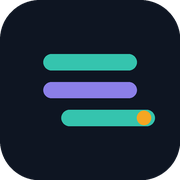

<p align="center">
  
</p>

<h1 align="center">Parallax</h1>
<p align="center"><i>Run and lift, in the same view.</i></p>

Parallax is a personal training app for people preparing for a race while also lifting.
It generates a race-driven training block that runs a periodized running plan and an
RP-style strength program on the same calendar, on purpose -- so a hard lower-body day
never lands the day before a key run, and strength volume backs off automatically as
race day gets close. Log a session and the plan adjusts: run paces autoregulate off
actual pace/HR, strength loads progress or back off off actual reps/RIR.

## What it does

- **One calendar, two plans.** A run periodization engine (base -> build -> peak -> taper)
  and an RP-style strength engine (accumulate -> maintenance, MEV -> MRV) share a single
  weekly calendar instead of living in separate apps. The strength mesocycle's deload
  timing is nudged toward the running plan's own down-weeks and taper, and a guardrail
  automatically shuffles (or flags) sessions so a hard lower-body day never sits the day
  before a quality or long run.
- **Race-driven planning.** Give it a race date and distance and it builds the whole
  block backwards from there, with a VDOT-based race-pace model and an optional goal
  time that overrides pace targets without touching your autoregulated day-to-day paces.
- **Autoregulation, not a fixed plan.** Log a run's actual pace/HR and the next
  session's targets adjust (bounded to a sane drift cap from your baseline). Log a
  strength set's actual reps/RIR and the next load is computed from an e1RM-based
  model -- progress, hold, or back off, with a real kg number, not just a label.
- **A weekly schedule that's actually yours.** Which days are for running, strength, or
  rest is an editable per-athlete setting, not hardcoded -- change it in Settings and
  every future session moves to match (history is never touched).
- **intervals.icu sync.** Structured run workouts push automatically to intervals.icu as
  the plan is generated, and from there to a watch. Entirely optional -- every
  intervals.icu-touching code path no-ops safely without credentials configured.
- **A daily job that keeps itself honest.** Once a day it pulls yesterday's activities,
  matches them to planned sessions, marks sessions completed or missed, autoregulates,
  and regenerates the plan forward -- with its own health status visible in Settings.
- **A UI built for actually using it day to day**: a phone-first "Today" view, a desktop
  planning view (phase timeline, weekly load chart, mesocycle status), session history,
  and a settings page for athlete profile and race management.
- **Self-hosted, single-user.** Optional HTTP Basic Auth gates every route; no accounts,
  no multi-tenancy -- this is a training log for one person, not a SaaS product.

See [`USER_GUIDE.md`](USER_GUIDE.md) for a walkthrough of actually using it day to day
(creating a race, logging sessions, editing the plan). [`SPEC.md`](SPEC.md) and
[`PROJECT_PLAN.md`](PROJECT_PLAN.md) are the original build spec and its full build
history, for anyone who wants the archaeology.

---

## Running it locally

```bash
cd backend
python3 -m venv .venv && source .venv/bin/activate
pip install -r requirements.txt

uvicorn app.main:app --reload
```

Visit `http://localhost:8000/` (today view) and `http://localhost:8000/plan` (desktop
planning view). On first run it seeds a default athlete profile and exercise library.
Create a race to generate a plan:

```bash
curl -X POST http://localhost:8000/api/races \
  -H "Content-Type: application/json" \
  -d '{"name":"City Half","race_date":"2026-10-04","distance_km":21.1,"priority":"A"}'
```

### Tests

```bash
cd backend
source .venv/bin/activate
python -m pytest
```

### Configuration

Environment variables (see `app/config.py`):

- `DATABASE_URL` -- defaults to a local SQLite file.
- `INTERVALS_ICU_API_KEY`, `INTERVALS_ICU_ATHLETE_ID`, `INTERVALS_ICU_BASE_URL` -- needed
  only for the intervals.icu client; every intervals.icu-touching code path no-ops
  safely without them.
- `ATHLETE_TIMEZONE` -- IANA timezone name (e.g. `Australia/Sydney`), default `UTC`.
  Everything that means "today" for the athlete (the Today view, plan-generation
  windows, the intervals.icu sync window, and the job trigger times below) is computed
  in this timezone, not the server's. Leaving this at the default `UTC` on a non-UTC
  server makes "today" wrong for however many hours the athlete's offset covers --
  set it to wherever you actually are.
- `DAILY_JOB_HOUR` -- local hour (in `ATHLETE_TIMEZONE`) the in-process scheduler runs
  the daily autoregulation job (default `6`).
- `ENABLE_SCHEDULER` -- set to `false` to disable the in-process APScheduler entirely
  (e.g. if you'd rather trigger `POST /api/jobs/daily-autoregulation` from an external cron).
- `AUTH_USERNAME`, `AUTH_PASSWORD` -- if both are set, every route (pages and API) is
  gated behind HTTP Basic Auth (`app/auth_middleware.py`). Unset by default. Basic Auth
  sends credentials base64-encoded, not encrypted, so put a reverse proxy with HTTPS in
  front before exposing this beyond a LAN.

## Deployment

Currently self-hosted via Docker on a home NAS, reachable on the LAN and gated behind
HTTP Basic Auth:

```bash
cd backend
docker build -t training-app .
docker run -d \
  --name training-app \
  --restart unless-stopped \
  -p 8000:8000 \
  -v training_app_data:/app/data \
  -e ENABLE_SCHEDULER=true \
  -e ATHLETE_TIMEZONE=Australia/Sydney \
  -e DAILY_JOB_HOUR=6 \
  -e INTERVALS_ICU_API_KEY=... \
  -e INTERVALS_ICU_ATHLETE_ID=... \
  -e AUTH_USERNAME=... \
  -e AUTH_PASSWORD=... \
  training-app
```

The intervals.icu and auth env vars are all optional. To pick up a new version: `git
pull`, re-run `docker build`, then `docker stop training-app && docker rm training-app`
and re-run `docker run` (the `training_app_data` volume persists your data). Schema
changes add/backfill their own columns automatically on startup -- see "Database
migrations" below, no manual migration step needed. Back up the SQLite file
(`/app/data/training_app.db`) periodically; it's the only durable state.

A Fly.io deployment is also fully wired up (`backend/fly.toml`) but not in active use --
kept in the repo in case a cloud instance is wanted later (`fly deploy` from `backend/`
after `fly auth login` and setting any intervals.icu secrets).

### Database migrations

No Alembic here -- deliberately, given the project's small single-file-SQLite scale.
`Base.metadata.create_all()` (run on every startup) only creates missing tables; when a
schema change adds a column to an existing table, `app/db.py` runs a small additive
migration alongside it (via SQLite's `PRAGMA table_info`, `ALTER TABLE ... ADD COLUMN`,
then backfills any computed defaults). Runs automatically on every startup, safe to run
repeatedly.

## Architecture

```
app/
  models.py                 SQLAlchemy models: AthleteProfile, Race, Macrocycle, Phase,
                             Mesocycle, PlannedSession, CompletedSession, Exercise
  db.py                      Engine/session setup + the additive SQLite migration path
  auth_middleware.py         Optional HTTP Basic Auth over every route (opt-in via env var)
  engines/
    running.py               Pure, DB-free periodization engine (race date + fitness ->
                              weeks); VDOT race-pace model + goal-time override live here
    vdot.py                   Daniels' VDOT formulas backing the race-pace model
    strength.py               RP mesocycle skeleton, race-proximity modulation, the
                               mesocycle-deload/running-phase coupling, and the
                               e1RM/load-prescription model
    calendar.py                Unified calendar + adjacency guardrail
    autoregulation.py         Run and strength feedback loops (pure functions)
    dashboard_summary.py      Phase-timeline ribbon + strength-mesocycle status for /plan
    load_summary.py           Weekly run-km/strength-tonnage aggregation for /plan
  integrations/
    intervals_icu.py        intervals.icu client (read activities/wellness, write planned
                             workouts)
  plan_service.py            Wires the engines to persistence for one race (history-safe:
                             only regenerates still-`planned` sessions from today forward)
  intervals_sync.py          Guarded push of upcoming run sessions to intervals.icu
  timeutil.py                 local_today() -- "today" in ATHLETE_TIMEZONE, not the
                             server's, used everywhere that means the athlete's actual day
  jobs/
    daily_autoregulation.py  The daily job: pull activities/wellness -> autoregulate ->
                             refresh -> re-sync -> record job health
  api/routes.py               FastAPI routes
  main.py                     App wiring, today/plan/settings/history/session HTML views,
                             APScheduler cron
  templates/, static/         Jinja2 + vanilla JS/CSS, no build step
```

The engines are deliberately pure/dataclass-based with no DB or HTTP dependency, so the
periodization rules are unit-testable in isolation (`backend/tests/`, 195 passing tests
covering the engines, plan regeneration/history preservation, intervals.icu sync, the
daily job, and a real FastAPI `TestClient` layer over the JSON API).
